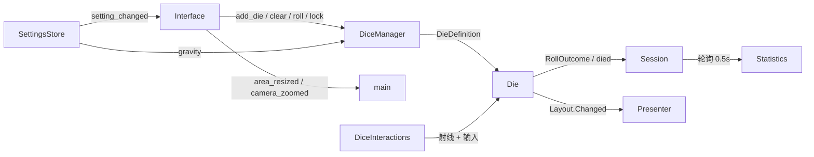

# DiceRoller C# 项目文档

本文档描述将 GDScript 物理骰子辊（Hundred Dice）移植为 Godot 4 C# 的目标、领域模型、模块边界，以及与原项目的对应关系。用语以仓库根目录 [CONTEXT.md](../CONTEXT.md) 为准。实现步骤见 [工作流程.md](./工作流程.md)。槽位与内容分离见 [adr/0001-face-slot-and-content.md](./adr/0001-face-slot-and-content.md)。

**源项目（只读对照）：** `d:\GitHub\diceRoller`（Godot 工程在 `godot/`）  
**目标项目（本仓库）：** `D:\GitHub\Godot-DiceRoller\dice-roller`  
**依据：** 原仓库 `README.md`、`LICENSE`、`godot/project.godot`、全部 `.gd` 脚本、`main.tscn` 与导出配置。

---

## 1. 项目是什么

C# 版 DiceRoller 是一个 **可嵌入其他 Godot C# 项目的 3D 物理骰子系统**，同时保留一份可独立运行的演示应用，用来对照原版行为。

原项目自称 *“Just a physics based dice roller”*：用刚体碰撞模拟掷骰，而不是用随机数直接给出点数。应用名在 `project.godot` 中为 **Hundred Dice**（作者署名 SteenQ；上游仓库 [Qubus0/diceRoller](https://github.com/Qubus0/diceRoller)）。

本仓库的目标不是逐像素复刻原 UI，而是：

1. **行为对等**：掷出、锁定、无效面、统计、抓取投掷等核心交互与原版一致。
2. **语言与引擎升级**：GDScript + Godot 3.x / Bullet / GLES2 → C# + Godot 4.7 / Jolt / Forward Plus。
3. **可复用**：骰子物理、朝向判定、面内容、设置存储与 UI 解耦，便于迁入卡牌 / RPG 等其他项目。
4. **面可替换**：朝上判定只识别几何槽位；点数、贴图、卡牌 id 等是槽位上的 FaceContent，可在运行时改，而不换碰撞体。

当前目标工程已把骰子资源收进 `addons/dice_roller/assets/`；无 Interface 的 `scenes/test_headless_table.tscn` 经 `IDiceTable` 生成、读 `RollOutcome`、改面。用法见 [嵌入指南.md](./嵌入指南.md)。设置窗 / Toast / Help / 原版 Theme 仍是 7b。

---

## 2. 范围

### 2.1 纳入移植

| 能力 | 原实现位置 |
|------|------------|
| d4 / d6 / d8 / d10 / d12 / d20 刚体骰子 | `godot/dice/` |
| 朝上点数判定与无效面（立住、叠放） | `abstractDie.gd` `get_rolled_side()` |
| 生成、随机抛出、重掷、清除 | `DiceManager.gd` |
| 鼠标抓取、拖拽投掷、右键锁定、叠放 | `DiceInteractions.gd` |
| 场地缩放、相机推拉 | `main.gd` |
| 运行时统计（总数、面值合计、分面计数） | `DiceData.gd` / `DieTypeData.gd` / `Statistics.gd` |
| JSON 设置（颜色、重力、UI 开关） | `SettingsData.gd` |
| 骰子选择条、操作按钮、设置窗、帮助窗、Toast | `godot/Interface/` |

### 2.2 明确不纳入（或列为后续）

| 项 | 原因 |
|----|------|
| 多人联机 | 原项目无网络代码；设置里的 Collaboration 只打开 Discord / GitHub |
| `addons/dice_syntax` 指令语法 | 插件被 `.gitignore` 排除，仓库中不存在；`CommandInput.gd` 只处理焦点，未解析表达式 |
| `addons/debug_draw` | 同样缺失；Autoload 指向不存在的脚本 |
| `World/camera.gd` 自由视角 | 未挂到 `main.tscn` 的 Camera 上，属于死代码 |
| HTML5 导出到 GitHub Pages | 原版 `export_presets.cfg` 输出到源仓库 `docs/`；C# 版另议 |

指令栏 UI（`4d6d1` 占位）可以保留开关，但 **第一期不实现解析器**。需要时单独做纯 C# 模块，不要绑死 Godot 3 插件。

### 2.3 第一期必须预留、但不必做完的能力

下列能力 **不** 作为演示应用的完成标准，但 Core 契约从第一期就要能表达，禁止用 `int 点数` 堵死：

| 能力 | 架构落点 | 第一期演示 |
|------|----------|------------|
| 经典 1..N 点数 | 标准数字 FaceLayout + NumericScore | 要做，对等原版 |
| 各面自定义图片 | Presenter 适配器（默认 `ImageFacePresenter` 用 Decal） | 接口 + Decal 换面；默认网格仍是烘焙数字 |
| 游戏中改某一面的含义或贴图 | 实例级可变 FaceLayout | 测一次 `Replace` 即可，不做编辑器 UI |
| 卡牌 / RPG 符号面（剑、法术、暴击…） | FaceContent.Id + 宿主 Payload；Session 按 Id 计数 | 演示应用不实现规则 |

自定义贴图依赖网格 UV 或 Decal 锚点。原版 glTF 数字是烤在材质上的；换图时由 Presenter 覆盖，不要改 `DieFaceMap` 采样点。

---

## 3. 双仓库与引擎对照

| | 源：Hundred Dice | 目标：DiceRoller |
|--|------------------|------------------|
| 路径 | `d:\GitHub\diceRoller\godot` | 本目录 |
| 引擎 | Godot 3.x（`config_version=4`） | Godot **4.7**（`config_version=5`，features `4.7` + Forward Plus） |
| 脚本 | GDScript | C# / .NET 8（Android 为 net9.0） |
| 程序集 | — | `DiceRoller`（`Godot.NET.Sdk/4.7.2`） |
| 渲染 | GLES2 | Forward Plus；Windows 驱动 d3d12 |
| 物理 | Bullet，`physics_fps=50`，重力 10 | **Jolt Physics** |
| 主场景 | `res://main.tscn` | `res://scenes/main.tscn` |
| 许可 | GPL-3.0 | 派生代码与拷贝的资源仍受 GPL-3.0 约束 |

### 3.1 许可（迁入其他项目前必读）

源仓库 `LICENSE` 为 **GNU GPL v3**。复制其脚本逻辑、场景、网格、材质、图标到本仓库或第三方游戏后，发行物通常也必须以 GPL-3.0 开源（含对应源代码）。若目标项目不能接受 copyleft，需要：

- 自绘网格 / 图标 / 着色器，并 **独立实现** 骰子逻辑；或
- 向原作者取得不同许可。

本文档不构成法律意见，但移植计划必须把许可当作硬约束。

---

## 4. 领域模型

用语以 [CONTEXT.md](../CONTEXT.md) 为准。原版把「槽位」和「点数」写成同一个 int；C# 版拆开，演示应用再用标准数字 FaceLayout 去对等 Hundred Dice。

```
PlayArea
  └── Die（刚体实例）
        ├── HullKind: d4 | d6 | …          壳体，决定碰撞与 FaceSlot
        ├── FaceLayout                     槽位 → FaceContent（可按实例改）
        ├── Presenter                      把 Layout 画到网格上
        ├── 最近一次 RollOutcome           Invalid，或槽位 + 内容快照
        ├── Locked
        └── InteractionState: None | Hovered | Clicked | Dragged

DieDefinition（生成原型，可共享）
  └── HullKind + 默认 FaceLayout + Presenter 种类

Session（当局，不落盘）
  └── 按 HullKind 或 Layout 方案聚合
        └── instanceId → 最近 RollOutcome
```

### 4.1 槽位与内容（硬约束）

朝上判定 **只** 回答「哪一个 FaceSlot 朝上」。它不知道点数、贴图或卡牌。

| 概念 | 变还是不变 | 例子 |
|------|------------|------|
| HullKind + FaceSlot 采样点 | 随网格固定 | d6 的 `Vector3.UP` 那一格永远是同一个 FaceSlotId |
| FaceContent | 每颗实例、任何时刻可变 | 该槽从「6」改成贴图 `res://cards/fireball.png`，Id 为 `spell.fireball` |
| Presenter | 可替换适配器 | 烘焙数字网格 vs 分面 Texture2D |
| NumericScore | 可选查询 | `Sum` = 各有效面 `NumericValue` 之和；无数值的面跳过 |

原版 `sides = { 6: Vector3.UP, ... }` 在移植时拆成：

1. `DieFaceMap`：`FaceSlotId → 局部采样点` + `max_side_height_difference`（向量与原脚本一致，含 d4 取反）。
2. `FaceLayouts.StandardNumeric(n)`：槽位 k 的 FaceContent 为 `Id="k"`、`NumericValue=k`、`Label="k"`。

判定算法与原版相同：各采样点变到世界坐标，Y 最高者获胜；最高与次高之差小于阈值则为 Invalid。Invalid **不是** 内容 Id `"0"`，也不是 FaceSlotId `0`。

动态改面的约定：

- `Spawn` 时 **复制** DieDefinition 的 FaceLayout，默认互不影响。宿主若要多颗骰共享同一张表，必须显式传入同一引用。
- `FaceLayout.Replace(slot, content)` 立即通知 Presenter；下一次朝上读取使用新内容。飞行中途改面不改写已经发出的历史 RollOutcome。
- 不要为了换图而 `queue_free` 再生成，除非连 HullKind 都换了（例如 d6 换成 d20）。

卡牌 / RPG 约定：

- 规则代码认 `FaceContent.Id`（及可选 Payload），不要解析 Label，也不要假设 `NumericValue` 存在。
- Session 可按 Id 计数（几张「暴击」、几张「火焰」）。NumericScore 仅给传统掷骰 UI 用。
- Payload 类型由宿主定义（卡牌资源、枚举等）。Core 用 `object?` 或泛型包装承载，不引用具体卡牌类型。

### 4.2 骰子实例（Die）与原版物理

- **HullKind 字符串** 仍作为默认场景键：`d4` … `d20`，由 Manager 注册到 PackedScene。这只表示壳体，不表示面上写了什么。
- **无效（Invalid）**：无唯一朝上槽位。无效时显示描边网格，并略微缩小 Mesh。
- **锁定**：换上 `BodyLocked` 材质；若 `allow_locked_move` 为真则只锁角速度轴，否则切到静态刚体并休眠。
- **掉出场地**：世界 `y < -4` 时 `respawn()`：先发重生（同 HullKind，**沿用该实例当前 FaceLayout**），再销毁并发出死亡。重生复制 Layout，避免自定义面丢失。

各类型阈值（来自各 `dN.gd` 的 `_init`）：

| 类型 | `max_side_height_difference` | 碰撞（场景内） |
|------|------------------------------|----------------|
| d4 | 0.6 | ConvexPolygon |
| d6 | 0.4 | BoxShape，半尺寸约 `(0.58, 0.58, 0.58)` |
| d8 | 0.3 | ConvexPolygon |
| d10 | 0.1 | ConvexPolygon |
| d12 | 0.15 | ConvexPolygon |
| d20 | 0.15 | ConvexPolygon |

d4 的采样点是面法线的 **取反**；d6 使用轴向 `Vector3.UP/DOWN/...`。不要在移植时“顺手规范化”这些向量，否则朝上判定会错。

骰子场景节点约定：

```
dN (RigidBody)          collision_layer = 2, mask = 3, mass = 3, gravity_scale = 4（可被设置覆盖）
├── Mesh                视觉网格；默认 Presenter 使用烘焙数字材质
│   └── Border          简化边线网格 + outline 着色器；MeshDataTool 也读它
└── CollisionShape
```

物理材质（嵌入各骰子场景）：摩擦约 0.95，弹性约 0.4。换图 Presenter 可以在 Mesh 上叠加分面材质或 Decal，**不要**为了贴图改 CollisionShape。

### 4.3 当局统计（Session）

不写入磁盘。每颗骰子约每秒发出一次 RollOutcome。C# 的 Session 按 HullKind（演示）或按 FaceContent.Id（RPG）聚合：

- `Count`：当前仍在追踪的实例数（含 Invalid）。
- `NumericScore.Sum`：只加总有效面上的 `NumericValue`；无数值或 Invalid 不加。
- 演示 UI 把 Invalid 显示为 `?`，数字面显示 `Label`。
- 按内容统计：`CountByContentId("crit")` 这类查询给卡牌/RPG 用，不要把 Id 解析回 int。

原版信号是 `die_rolled(type, rolled_side, instance_id)`。对照时：`type` → HullKind，`rolled_side` → 仅当 Layout 是标准数字时才等于槽位的 NumericValue。实现里禁止再把这三者绑死。

用 `GetInstanceId()` 当键时，销毁后必须摘除，避免幽灵统计。

### 4.4 设置键

原版没有独立 schema，键在 UI 第一次写入时出现。已知键：

| 键 | 用途 | 默认（代码中的 fallback） |
|----|------|---------------------------|
| `last_version` | 版本 Toast 是否已显示 | 与 `main.version` 比较 |
| `invert_scroll` | 滚轮缩放方向 | false |
| `invert_resize` | Shift+滚轮改场地大小方向 | false |
| `allow_locked_move` | 锁定后是否仍可平移 | 未在 General 的 `apply_settings` 中恢复（原版缺口） |
| `gravity` | `gravity_scale` | Manager 用 4；General 滑条 fallback 写的是 10，不一致 |
| `use_commands` | 隐藏 DiceSelect、显示指令栏 | false |
| `show_input_d4` … `show_input_d20` | 各类型输入条可见性 | 未设置则保持场景默认 |
| `body_color` / `number_color` / `border_color` | 共享材质 / 描边 shader | 资源文件中的颜色 |

颜色从 JSON 读回时，原版用 `str2var("Color(" + value + ")")`。C# 侧应使用明确的序列化（例如 HTML `#RRGGBB` 或 `r,g,b,a`），不要依赖 GDScript 的 `Color(...)` 字符串。

---

## 5. 原项目结构

```
d:\GitHub\diceRoller\
├── LICENSE                 GPL-3.0
├── README.md
├── docs\                   HTML5 导出产物（不是源码）
└── godot\                  Godot 3 工程
    ├── project.godot
    ├── main.tscn / main.gd
    ├── default_env.tres
    ├── dice\               网格、材质、每面脚本
    ├── World\              管理器、交互、墙、未使用的 camera.gd
    ├── Services\           Autoload：DiceData、SettingsData、DieTypeData
    └── Interface\          UI 场景、主题、图标、字体、脚本
```

Autoload（`project.godot`）：

- `DiceData` → `res://Services/DiceData.gd`
- `SettingsData` → `res://Services/SettingsData.gd`
- `DebugDraw` → `res://addons/debug_draw/debug_draw.gd`（缺失，移植时删除）

启用但缺失的编辑器插件：`res://addons/dice_syntax/plugin.cfg`。

物理层：layer 1 = `Box`，layer 2 = `Dice`。骰子 mask=3（场地 + 骰子互撞）。

窗口：基准 1440×900，测试分辨率 2880×1800，stretch `2d` + `expand`。

---

## 6. 运行时架构

### 6.1 主场景树（`main.tscn`）

```
main (Spatial)                          main.gd
├── Interface                           Interface.tscn
├── Box (scale ≈ 0.2)                   场地；main.global_area_scale
│   ├── Floor (StaticBody, layer 3)
│   ├── OtherBoxSides                   Roof + 四面 wall.tscn
│   └── ResizeTicks (0.15s)
├── DiceManager                         子节点 = 在场 Die
├── DiceInteractions
│   ├── RotateTicks (0.2s，按住旋转加速)
│   ├── MinDistance / MaxDistance       拖拽时抬高，避免穿模
│   └── GrabArea                        点重力，空地点击时“吸”骰子
├── DirectionalLight
└── Camera + ZoomTicks (0.15s)
```

`Box` 的初始 scale 与 `main.global_area_scale` 默认 `0.2` 一致。缩放范围约 `0.15 … 1.4`，步进 `0.02`。相机沿自身 translation 方向推拉，距离夹在 `4 … 60`。

### 6.2 信号流



C# 版用 RollOutcome 替代原 `die_rolled(type, rolled_side)`。演示 UI 仍可从 `Content.NumericValue` 画出原版统计。

场景里写死的连接（`main.tscn`）：

| 信号 | 从 | 到 |
|------|----|----|
| `add_die` | Interface | DiceManager `_on_Interface_add_die` |
| `clear_dice` | Interface | DiceManager `_on_Interface_clear_dice` |
| `roll_all` / `roll_invalid` / `lock_valid` | Interface | DiceManager 对应方法 |
| `area_resized` / `camera_zoomed` | Interface | main |
| Timer `timeout` | ResizeTicks / ZoomTicks / RotateTicks | main 或 DiceInteractions |

`DiceInteractions` **不**经过 Interface，直接处理未处理输入。C# 版应保持这条独立通道，避免 UI 焦点把 3D 抓取吃掉。

硬编码节点路径（移植时改为导出引用或组）：

- `$"/root/main"`
- `$"/root/main/Box/Floor/CollisionShape"`
- `$"/root/main/Box/OtherBoxSides"`
- `$"/root/DiceData"`

### 6.3 交互状态机

`Die.states`：`NONE → HOVERED → CLICKED → DRAGGED`。

| 输入 | 行为 |
|------|------|
| 悬停 | 光标变为可拖拽（HTML5 与桌面的 `CURSOR_DRAG` / `CURSOR_CAN_DROP` 在原版是反的） |
| 左键按下 | Hovered → Clicked |
| 左键移动 | Clicked → Dragged；贴在高度 `dragging_height` 的水平面上，并把朝上面旋到世界 UP |
| 左键松开（拖拽中） | 按鼠标位移投出，速度上限 80 |
| 左键双击 | 随机上抛 |
| 右键 / 动作 `down`（S / ↓） | 悬停：切换锁定；拖拽中：放下并锁定（可叠在其他骰上） |
| 动作 `up`（W / ↑） | 解锁并随机抛 |
| 动作 `left`/`right`（注意：与箭头直觉对调，见输入表） | 拖拽中绕世界 UP 旋转，`PI/32` 步进 |
| `delete`（Backspace） | 销毁当前悬停骰子 |
| 空白处左键按下 | 打开 GrabArea 空间覆盖，把附近骰子吸向鼠标 |

### 6.4 生成与重掷

`randomize_throw`：在按 `global_area_scale` 缩放后的地板半尺寸内随机位置，给水平线速度 `(±2..3, 0, ±2..3)` 与角速度各轴 `±5..10`。

`roll`：给已有骰子向上速度，上限与场地缩放有关。锁定骰子原版 **不会** 在 `roll()` 里跳过，重掷前若仍是 STATIC 可能表现异常——C# 版应在重掷时显式解锁或切回刚体，作为有意的行为对齐或修正，并在实现时写清选择。

---

## 7. C# 目标模块（面向复用）

按“以后迁到其他项目”划分。**Core 不得引用场景路径或 Control 节点。**

```
DiceRoller.Core            纯逻辑：DieFaceMap、FaceLayout、RollOutcome、Session、NumericScore
DiceRoller.Physics         RigidBody3D 骰子、生成、抛掷、场地、抓取（不解释 FaceContent）
DiceRoller.Presentation    Presenter：烘焙数字 / 分面贴图（可引用 Texture2D；Core 不引用）
DiceRoller.Settings        JSON 存储 + 把颜色应用到材质
DiceRoller.Ui              选择条、统计面板、窗口铬、Toast（Godot Control）
DiceRoller.App             主场景装配、Autoload、InputMap、演示程序
```

建议目录（相对本工程）：

```
addons/dice_roller/          可整体复制到其他 Godot C# 项目的插件形态（推荐终点）
  Core/
  Physics/
  Presentation/
  Settings/
  Ui/
  plugin.cfg                 若以 EditorPlugin / 运行时 Autoload 提供
scenes/                      演示用主场景（应用层，不进插件）
scripts/                     仅演示入口；库代码不要放这里
docs/
```

第一期可以先把类型放在 `scripts/` 下按文件夹分开，但 **公共 API 从一开始就要像插件一样设计**，避免 `$"/root/main"`。

### 7.1 建议的对外 API（其他项目使用）

完整步骤与拷贝清单见 **[嵌入指南.md](./嵌入指南.md)**。其他游戏嵌入时，应只依赖类似下面的入口，而不是去点 UI 按钮。`Sum` 不是主结果。

```csharp
// 示意，不是当前代码
public interface IDiceTable
{
    DieBody Spawn(DieDefinition definition);
    DieBody SpawnStandard(string hullKind); // 复制该壳体的标准数字 FaceLayout
    void Clear(string hullKind = null);
    void RollAll();
    void RollInvalid();
    void LockValid();
    int Count { get; }
    event Action<RollOutcome> Rolled;
}

public sealed class FaceContent
{
    public required string Id { get; init; }
    public string Label { get; init; } = "";
    public int? NumericValue { get; init; }
    public string? TextureKey { get; init; }   // Presenter 解析为贴图；Core 不当 Texture2D 用
    public object? Payload { get; init; }      // 宿主卡牌 / 枚举 / 资源
}

public sealed class FaceLayout
{
    public FaceContent this[FaceSlotId slot] { get; }
    public void Replace(FaceSlotId slot, FaceContent content);
    public FaceLayout Clone();
    public event Action? Changed;
}

public readonly record struct RollOutcome(
    ulong InstanceId,
    string HullKind,
    bool IsValid,
    FaceSlotId Slot,
    FaceContent Content   // Invalid 时使用 FaceContent.None，不要用数字 0
);

public static class NumericScore
{
    public static int Sum(IEnumerable<RollOutcome> latestPerDie);
}
```

典型宿主用法：

- **传统掷骰：** `SpawnStandard("d20")`，UI 读 `NumericScore.Sum`。
- **运行时改面：** `die.Layout.Replace(slot, content)`，不必重新生成刚体。
- **图片骰：** FaceContent 带 `TextureKey`，安装 `ImageFacePresenter`；壳体仍是 d6。
- **卡牌/RPG：** `Payload` 指向卡牌数据；战斗规则订阅 `Rolled`，按 `Content.Id` 结算。

场地大小、相机、主题属于 App / 宿主项目。当前代码：`addons/dice_roller/Physics/IDiceTable.cs`，由 `DiceTable`（场景根）与 `DiceManager` 实现。`SpawnStandard` 接受 `HullKind` 或 `"d4"`…`"d20"`；`Clear()` / `Clear(HullKind)` 是两个重载，不是可空字符串。

### 7.2 GDScript → C# 类型对应

| 原 class_name / 文件 | C# 建议 |
|----------------------|---------|
| `Die` (`abstractDie.gd`) | `DieBody` + `DieFaceMap` + `FaceLayout` |
| `d4.gd` … `d20.gd` | `DieFaceMap` 静态数据（仅采样点与阈值），不要六个子类 |
| `DieTypeData` | Session 聚合（按 HullKind 或按 Content.Id） |
| `DiceData` Autoload | `DiceSession` |
| `SettingsData` Autoload | `SettingsStore` |
| 烘焙在网格上的数字材质 | 默认 `BakedNumeralPresenter` |
| （原版没有） | `ImageFacePresenter` / 宿主自定义 Presenter |
| `Window` / `WindowContainer` / `Toast` / `CheckToggle` | 同名 Godot 节点脚本 |
| `DiceManager` | `DiceManager`（按 DieDefinition 生成） |
| `DiceInteractions` | `DiceInteractionController` |
| `main.gd` | `DiceTableApp`（Node3D） |

---

## 8. 脚本清单与职责

### 8.1 世界与骰子

| 源文件 | 职责 |
|--------|------|
| `main.gd` | 版本 Toast、滚轮/手势缩放与改场地、唤醒骰子 |
| `World/DiceManager.gd` | 实例化、抛出、批量操作、重力设置 |
| `World/DiceInteractions.gd` | 拾取与投掷 |
| `World/camera.gd` | 未使用的自由相机（不移植） |
| `dice/scripts/abstractDie.gd` | 刚体骰子核心 |
| `dice/scripts/d4.gd` … `d20.gd` | 只填 `sides` 与阈值 |

### 8.2 服务

| 源文件 | 职责 |
|--------|------|
| `Services/SettingsData.gd` | `user://settings.json`；`listen(node, method)` 观察者 |
| `Services/DiceData.gd` | 按类型汇总 |
| `Services/DieTypeData.gd` | 单类型实例与分面列表 |

### 8.3 界面

| 源文件 | 职责 |
|--------|------|
| `Interface.gd` | 信号枢纽、数字键 1–9 快速添加、批量添加的短 yield |
| `DiceSelect.gd` | 单类型：数量框 + 添加 + 清除 |
| `NumberInput.gd` | 只允许正整数，滚轮改数 |
| `CommandInput.gd` | 失焦；**无解析** |
| `Statistics.gd` / `DieTypeStatistic.gd` | 0.5s 刷新；按 `int("d20")` 排序类型 |
| `Window.gd` / `WindowContainer.gd` | 可拖拽窗、Esc / 点遮罩关闭；关闭 Settings 时保存 |
| `Toast.gd` | BBCode + Tween；链接 `OS.shell_open` |
| `SettingsWindowGeneral.gd` / `Dice.gd` / `Collaboration.gd` | 设置页 |
| `CheckToggle.gd` / `SimpleColorPickerButton.gd` / `IconButton.gd` | 自定义控件（部分 `tool`） |
| `Shortcut.gd` / `MouseInput.gd` | 帮助里的按键图示，语法如 `[lmb]`、`[key=W]` |
| `LockValidDiceButton.gd` | 切换锁/开锁图标 |
| `DicePreview.gd` / `MultipleDicePreview.gd` | 设置页预览（Viewport 尺寸 ×2；预览 d12 默认锁定） |
| `FitContentContainer.gd` | Scroll 高度贴合子控件 |

导出清单里出现过 `Help.gd` / `HelpWindow.gd` / `Settings.gd`，当前源树 **没有** 这些文件。帮助与设置实际由 `Window.tscn` + 内容 PackedScene 拼出来。移植时以磁盘上的脚本为准。

---

## 9. 输入动作

自定义动作（Godot 3 scancode / physical_scancode）在 C# 工程的 Input Map 中重建：

| 动作 | 绑定（摘要） |
|------|----------------|
| `add_die` | N |
| `add_max` | M |
| `roll` | Space、R |
| `roll_invalid_only` | Shift+Space、Shift+R |
| `lock_dice` | L |
| `clear` | C |
| `scroll_up` / `scroll_down` | 滚轮 |
| `left` | **右箭头** + **D** |
| `right` | **左箭头** + **A** |
| `up` / `down` | W/↑、S/↓ |
| `delete` | Backspace |
| `size_up` / `size_down` | Shift+`+` / Shift+`-` |
| `zoom_in` / `zoom_out` | `+` / `-` |
| `number_shortcut` | 1–9 |

`left`/`right` 与箭头对调是原版刻意设计（拖拽时用 A/D 旋转）。移植时保持绑定，不要“修正”成方向键字面含义。

---

## 10. 资源：复制 vs 重写

### 10.1 复制后在 Godot 4 中重新导入

- `dice/gltf/*.gltf`（视觉）与 `*collision.gltf`（碰撞源）
- `dice/d4.tscn` … `d20.tscn`（内嵌 ArrayMesh，体积大；优先拷场景再换 C# 脚本，不要重导网格除非碰撞坏了）
- `dice/materials/*.material`、`outline.shader`、`lock.shader`、`*.tres`
- `Interface/Icons/*.png`、`Fonts/*.ttf` 及对应 LICENSE
- `World/wall.tscn`、`default_env.tres`、`icon.png`

Godot 3 的 `.import` 不要拷贝；让 4.x 重新生成。着色器需改为 Godot 4 语法（`hint_color` → `source_color` 等）。

### 10.2 必须重写

- 全部 `.gd`
- `project.godot` 输入、Autoload、物理、显示
- 场景中的脚本引用与信号连接
- SpatialMaterial → StandardMaterial3D；节点类型见工作流程中的 API 表

### 10.3 路径大小写

磁盘上是 `Interface/scripts/`，`project.godot` 写的是 `Interface/Scripts/`。Windows 不敏感，Linux CI 会炸。C# 工程统一用小写文件夹名。

---

## 11. 目标工程现状

| 文件 | 状态 |
|------|------|
| `project.godot` | Godot 4.7、Jolt、主场景 `res://scenes/main.tscn`、窗口 1440×900、物理层 Box/Dice、重力 10、自定义 Input Map；Autoload `DiceSession`、`SettingsStore`（`user://settings.json`） |
| `DiceRoller.csproj` | `Godot.NET.Sdk/4.7.2`，`net8.0` |
| `Directory.Build.props` | 把中间输出固定到仓库 `obj/`，避免 Cursor C# 语言服务找不到 `Godot` 命名空间 |
| `.gitattributes` | `* text=auto eol=lf`；`*.png` / `*.ttf` / `*.material` 标为 `binary` |
| `scripts/DiceTableApp.cs` | 演示主场景：滚轮缩放；F2/F3/F4/`[`/`]`。空格/L/C 在 `DiceHud` |
| `scripts/HeadlessTableApp.cs` | 最小宿主：`Spawn` d6 + `ImageFacePresenter`、Replace `sword`、订阅 `Rolled` |
| `scenes/main.tscn` | 完整演示（含 `DiceHud`） |
| `scenes/test_headless_table.tscn` | 无操作栏；实例 `DiceTable.tscn` |
| `addons/dice_roller/DiceTable.tscn` | 场地 + Manager + Interactions，实现 `IDiceTable` |
| `addons/dice_roller/Core/` | `DieFaceMap` / `FaceLayout` / `FaceReader` / `DieDefinition` / `DiceSessionState` / `DragMath` / `ArenaMath` / `NumericScore` / `SettingsCodec` / `SessionStats` / `HullKinds` |
| `addons/dice_roller/Physics/` | `IDiceTable`、`DiceTable`、`DieBody`、`DiceManager`、`DiceAssets`（场景/材质路径）、`DiceInteractionController`、`ArenaController`；不读 `$"/root/main"` |
| `addons/dice_roller/Presentation/` | `IFacePresenter`（Bind/Apply/Unbind）、`BakedNumeralPresenter`、`ImageFacePresenter`（Decal）、`DiceTheme` |
| `addons/dice_roller/Session/` | Autoload `DiceSession`：`Outcomes`、`CountByContentId` |
| `addons/dice_roller/Settings/` | Autoload `SettingsStore`；Load/Save JSON；颜色 `#rrggbb`；`Set` 即写盘 |
| `addons/dice_roller/Ui/` | `DiceHud`（根 `MouseFilter=Ignore`）、`DiceSelect`、`NumberInput`；图标来自 `Interface/Icons/` |
| `addons/dice_roller/assets/dice/` | `d4.tscn`…`d20.tscn`、gltf、材质；d6 碰撞 `BoxShape3D` size `(1.16, 1.16, 1.16)` |
| `addons/dice_roller/assets/faces/` | 演示贴图 `example.png`（`DiceAssets.ExampleFace`） |
| `addons/dice_roller/assets/world/wall.tscn` | `StaticBody3D` + `BoxShape3D` size `(60, 120, 20)` |
| `docs/嵌入指南.md` | 宿主 / agent：拷贝清单、Autoload、物理层、`IDiceTable` 示例、GPL |
| `tests/DiceRoller.Tests.csproj` | FaceMap / Session / DragMath / ArenaMath / NumericScore / SettingsCodec / SessionStats / HullKinds |
| `Interface/Icons/`、`Interface/Fonts/` | 图标已给 HUD 用；字体 tres 仍为 Godot 3 `DynamicFont`，主题留 7b |

---

## 12. 成功标准

移植可视为达到“可迁入其他项目”的最低标准，当且仅当：

1. 能生成六种壳体；标准数字 FaceLayout 下，朝上槽位与原版采样表一致（每种 HullKind 抽检至少 3 个槽位）。
2. Invalid（明显斜靠）显示描边且不计入 NumericScore。
3. 抓取、甩出、锁定、解锁、清除、重掷无效、锁定有效面，行为与原版热键一致。
4. 演示统计的件数 / 合计 / 分面人数与场上一致；销毁后无残留。
5. 设置颜色与重力在重启后恢复。
6. 无 Interface 的最小场景能 `Spawn`、读 `RollOutcome`，并能对单颗骰 `Layout.Replace` 后读到新的 `Content.Id`（不必有换图 UI）。
7. 对外事件与 Session **不是** 以 `int side` 为唯一结果类型。
8. 文档中的 GPL 约束已在目标宿主项目中被明确接受或规避。

指令语法、完整图片骰编辑器、HTML 导出、自由相机 **不是** 成功标准。
